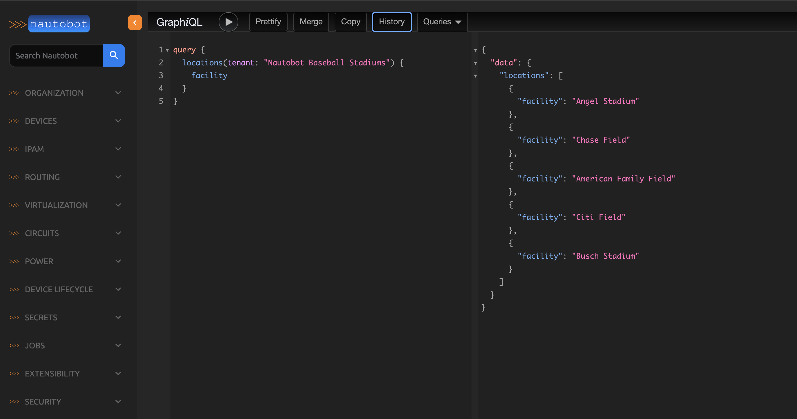
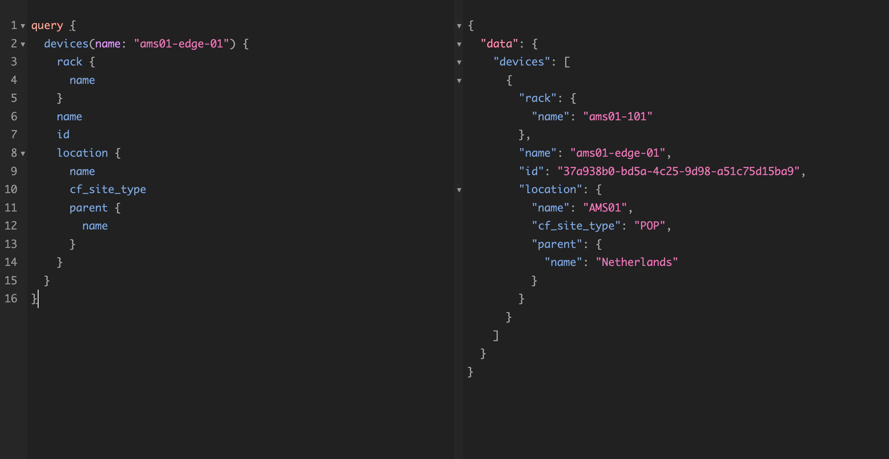
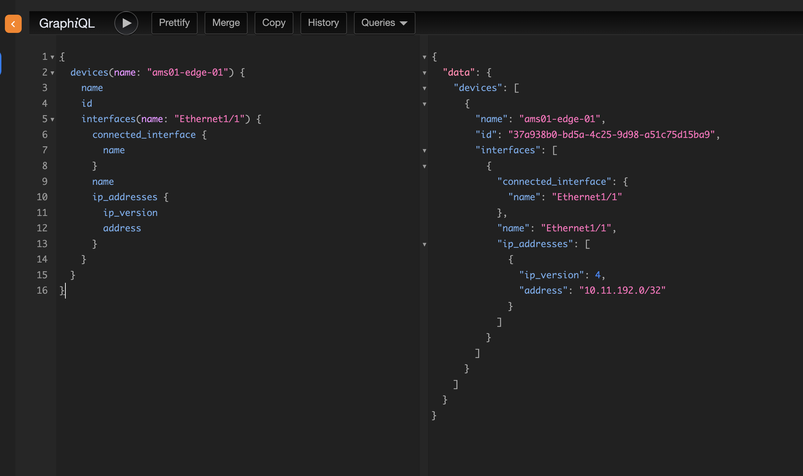

# GRAPHQL Challenge

This is a series of challenges utilizing Nautobot's GraphQL API.

GraphQL is a powerful query language for APIs that allows for descriptive and
efficient data queries. Utilizing JSON-formatted queries over HTTP, it allows 
clients to ask for specific data elements and attributes, and to make complex 
queries that span multiple tables (much like SQL JOINs, but utilizing heirarchial
JSON structures to make these easier to work with).

Nautobot's GraphQL API can be queried via its own web UI in Nautobot. See 
https://demo.nautobot.com/graphql.


The query language follows the same keys that are exposed by Nautobot's REST API. However,
under GraphQL, only the requested keys are returned in the reply:



Where a JSON query normally returns object IDs for associated elements which must be queried separately, the GraphQL
implementation allows for a query that can include elements from those references objects.




GraphQL queries can be filtered by values in any of the object's fields, such as name, tags, role, or similar. 



## API Access

The included gql_query python module provides a class and a reference implementation of a GQL query; use this for
your experimentation. Note that the model is async, which requires that it be called using async methods.

## Challenges
Challenges for this scenario are in CTFd. Start at https://ctfd.hackathon.nanog.org/challenges#NB%203.1%20Basic%20GQL%20Query-10 and go from there.

## Development Environment
Note that this repo uses [[Poetry](https://python-poetry.org/)] to manage dependencies. Follow [[instructions](https://python-poetry.org/docs/#installing-with-pipx)] to install, then run the following to activate a venv with needed dependencies (ensure you are in this directory)

```
# Ensure you are in the correct directory
ls -l | grep pyproject.toml
# install dependencies
poetry install
# Activate venv with needed dependencies
poetry shell
```

To add new modules to the virtual environment, run `poetry add <module_name>` using the same module name you would use in a `pip install` command.
